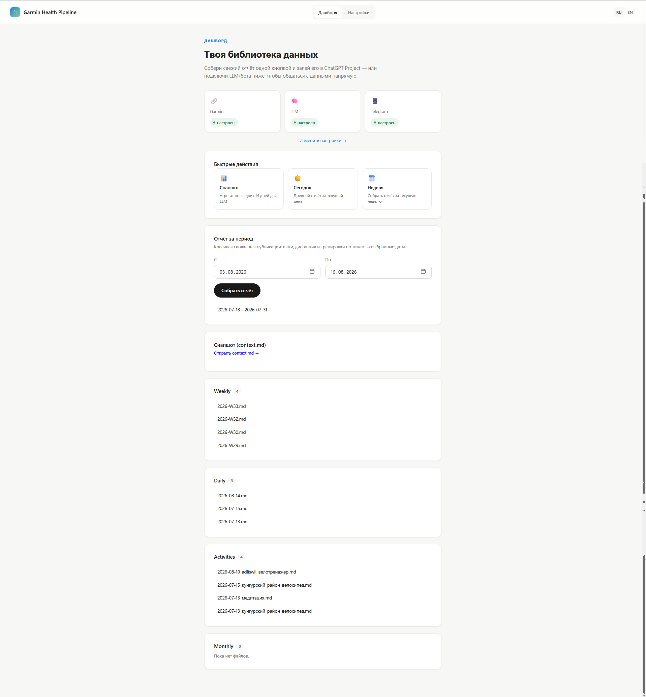

# Garmin Health Pipeline

*[Читать на русском](README.md)*

**Self-hosted AI agent for Garmin Connect**: reads sleep, HRV, stress, Body Battery and workouts, answers questions and creates workouts in Garmin through a Telegram bot or ChatGPT — no third-party server, your own keys, or fully local.

[](https://github.com/TolmachevKirill/garmin_ai/releases/latest)



Pulls your data out of Garmin Connect, caches it locally, and turns it into:

1. a **file "library"** (markdown + CSV) for manually uploading to a ChatGPT
   Project — one that already has context about your lifestyle, so ChatGPT
   analyzes new files against that background;
2. a **ready-to-run distribution** (web UI + Telegram bot + your own LLM key
   or a local model) — if you don't want to shuffle files by hand and would
   rather just message a bot "how was my week?" and get an answer.

This is an open-source, self-hosted project: not a single byte of your data
goes anywhere except Garmin Connect and whichever LLM provider you point it
at yourself (including a fully local Ollama/LM Studio setup — in which case
it doesn't leave your machine at all).

## Two ways to use it

| Way | For whom | What to do |
|---|---|---|
| **CLI + manual upload to ChatGPT** | Already using ChatGPT Projects, want full control | See [Setup](#setup) + [Commands](#commands) |
| **Skill/AGENTS.md for a coding agent** | Working in Cursor, Claude Code or Codex and want to just ask the agent in plain language | See [Skill/AGENTS.md for coding agents](#skillagentsmd-for-coding-agents) |
| **MCP server** | Want to pull data from Claude Desktop or another MCP client without direct shell access | See [MCP server](#mcp-server-for-external-llm-clients) |
| **Windows distribution (exe)** | Want the web dashboard and Telegram bot without installing Python | See [Windows distribution](#windows-distribution-exe) |

## Architecture

```
garmin_pipeline/
├── config.py             settings: .env + data/config.json (json takes priority)
├── client.py              Garmin login + token cache
├── cache.py               SQLite: daily_metrics, activities, raw_payloads
├── analyze.py             pandas layer over the cache + cache coverage diagnostics
├── formatting.py          markdown templates (daily/weekly/context/activity)
├── library.py             writes files + _index.md + reads them back for the web dashboard
├── rollup.py              monthly rollup built from the cache
├── llm_client.py          BYOK/BYOM wrapper over an OpenAI-compatible API + the agentic tool-calling loop
├── actions.py             shared read/write Garmin actions (used by the MCP server and the agentic bot)
├── agent_tools.py         OpenAI tools schema + dispatcher on top of actions.py (for bot.py)
├── ollama_setup.py        status/install/download for the local model (Ollama)
├── bot.py                 Telegram bot (polling, agentic tool-calling + human-in-the-loop confirmations)
├── mcp_server.py          MCP server (read-only wrappers over actions.py) for external LLM clients
├── webapp/                FastAPI: /setup, /dashboard, /view, /api/ollama/*
├── collectors/
│   ├── daily.py            biometrics + workouts for a single day
│   ├── weekly.py            weekly aggregation + comparison with the previous week
│   ├── activity.py          search/export of specific workouts, HR zones, strength sets (exercises/reps/weight)
│   ├── context.py           aggregated N-day snapshot for an LLM
│   ├── fit.py                download/parse of the original FIT file
│   └── workouts.py           writes structured workouts back to Garmin
└── cli.py                 entry point (see examples below)

desktop_app.py            entry point for the Windows distribution (web + bot)
desktop_app.spec           PyInstaller build spec
AGENTS.md                 CLI instructions for Codex and other agents without a Skill format
.cursor/skills/garmin-health/SKILL.md   the same CLI guide in Skill format for Cursor
.claude/skills/garmin-health/SKILL.md   the same CLI guide in Skill format for Claude Code

data/                     created automatically, not committed to git
├── config.json             settings from the /setup web form (takes priority over .env)
├── tokens/                 Garmin session
├── cache.sqlite3           metric history + raw Garmin API responses
└── library/                <- this is the folder you upload to a ChatGPT Project
    ├── daily/2026-07-12.md
    ├── weekly/2026-W28.md
    ├── monthly/2026-06.md
    ├── context/2026-07-15.md
    ├── activities/2026-07-05_trail_run.md (+.csv)
    └── _index.md
```

Key design decisions:

- **Weekly** — runs on a schedule (Windows Task Scheduler), independent of
  daily files.
- **Daily / workouts / context** — generated on demand: the library doesn't
  fill up with a file for every single day, only when there's actually
  something to discuss.
- **You can ask for a workout export in plain language** — `activity
  search`/`export` finds candidates by date/type/name; if the match is
  ambiguous it prints a list to disambiguate instead of guessing.
- **Raw-first cache**: raw Garmin API responses are stored in
  `raw_payloads` before normalization — if a new derived field is needed
  later for old dates, there's no need to hit Garmin again.
- **FIT parsing**: for per-kilometer splits the pipeline first tries to
  download and parse the activity's original FIT file (more accurate than
  the sparser time-series points from the API), falling back to synthetic
  splits from time-series data only if that fails.
- **BYOK/BYOM LLM**: `llm_client.py` talks to any OpenAI-compatible
  `/chat/completions` endpoint — OpenAI, [Cloud.ru Evolution Foundation
  Models](https://cloud.ru/docs/foundation-models/ug/topics/quickstart)
  (recommended for users in Russia, since OpenRouter is no longer reachable
  without a VPN), DeepSeek, or a local Ollama/LM Studio — the same code path,
  no provider-specific branches.

## Setup

```powershell
python -m venv .venv
.venv\Scripts\Activate.ps1
pip install -r requirements.txt
Copy-Item .env.example .env
```

Open `.env` and, if you want, fill in `GARMIN_EMAIL`/`GARMIN_PASSWORD` (only
needed for the first login — a saved token is reused afterwards, and you can
delete them from `.env`). The same file has optional fields for the LLM and
Telegram bot (see [BYOK/BYOM LLM and Telegram bot](#byokbyom-llm-and-telegram-bot)) —
it's usually easier to configure those once through the `/setup` web form
(see below), which writes to `data/config.json`, which takes priority over
`.env`.

First login (may ask for an MFA code):

```powershell
python -m garmin_pipeline.cli login
```

## Commands

```powershell
# Weekly report (usually scheduled, but can be run by hand too)
python -m garmin_pipeline.cli weekly

# Daily report on demand
python -m garmin_pipeline.cli daily --today
python -m garmin_pipeline.cli daily --date 2026-07-12

# Aggregated snapshot of the last N days in a single file - handy for an LLM/bot
python -m garmin_pipeline.cli context --days 14

# "Raw" JSON for a date range (daily metrics + workouts, no aggregation) -
# for ad hoc questions with no dedicated command: the model computes the
# answer itself (in a chat with the agent or via the MCP server, see below),
# not the Python pipeline
python -m garmin_pipeline.cli export --from 2026-07-18 --to 2026-07-31

# Shareable report for a date range (steps/distance + workouts by type with
# count/total/average) - see also the pretty /range page in the web
# dashboard. Days already synced are not re-fetched from the Garmin API (see
# sync below) - only missing days + today.
python -m garmin_pipeline.cli range --from 2026-07-18 --to 2026-07-31

# Background cache sync for the last N days, without writing any files -
# keeps range/weekly/context "warm" (see automation below)
python -m garmin_pipeline.cli sync --days 3

# Find a workout in plain language (no export - just look at the candidates)
python -m garmin_pipeline.cli activity search --latest
python -m garmin_pipeline.cli activity search --from 2026-07-05 --to 2026-07-11 --type running

# Export a workout (md + CSV of track points, FIT-based splits with a fallback)
python -m garmin_pipeline.cli activity export --latest
python -m garmin_pipeline.cli activity export --date 2026-07-05 --type running
# if multiple matches are found, the command prints a list and asks you to
# disambiguate with --id:
python -m garmin_pipeline.cli activity export --date 2026-07-05 --id 123456789

# Roll an old month into a monthly report (to clean up daily files from the library)
python -m garmin_pipeline.cli rollup --month 2026-06

# Rebuild _index.md by hand
python -m garmin_pipeline.cli index

# Local cache diagnostics: which days are missing data over the last N days
python -m garmin_pipeline.cli cache coverage --days 30

# Create and schedule a structured workout in Garmin Connect
python -m garmin_pipeline.cli workout create --sport running --name "Easy run" `
    --steps-json '[{"kind":"warmup","duration_s":300},{"kind":"interval","duration_s":1200},{"kind":"cooldown","duration_s":300}]' `
    --date 2026-07-20

# "hr_zone": 1-5 on any step - the watch will alert (vibration/beep) if your
# heart rate leaves that zone during the step (zone boundaries come from your
# Garmin Connect profile, not set here)
python -m garmin_pipeline.cli workout create --sport running --name "Run with Z2 alert" `
    --steps-json '[{"kind":"warmup","duration_s":1680,"hr_zone":2},{"kind":"interval","duration_s":1200},{"kind":"cooldown","duration_s":960,"hr_zone":2}]'

# Strength/core workout (sport strength_training/cardio_training/hiit): "exercise"
# steps (reps OR duration_s, category+exercise_name from Garmin's built-in
# catalog, optional weight_kg) and "rest" steps between sets. If weight_kg is
# omitted, the weight is free-form (chosen on the spot), but the actual
# weight used still shows up in the completed activity's exercise_sets (see
# activity export).
python -m garmin_pipeline.cli workout create --sport strength_training --name "Core and glutes" `
    --steps-json '[{"kind":"exercise","category":"HIP_STABILITY","exercise_name":"DEAD_BUG","reps":20},{"kind":"rest","duration_s":30},{"kind":"exercise","category":"HIP_STABILITY","exercise_name":"DEAD_BUG","reps":20}]'

# Local web interface (/setup, /dashboard) - see below
python -m garmin_pipeline.cli web --port 8765

# Telegram bot (polling, blocks the process) - requires a configured telegram_bot_token
python -m garmin_pipeline.cli bot
```

## Weekly automation (Windows Task Scheduler)

```powershell
.\scripts\register_weekly_task.ps1
# a different time/day:
.\scripts\register_weekly_task.ps1 -DayOfWeek Monday -Time "07:30"
```

The script finds `python` on its own (checks `.venv` first, falls back to
the system interpreter) and registers a task that writes
`data/library/weekly/{ISO-week}.md` once a week.

## Daily sync automation (Windows Task Scheduler)

By default the local cache (SQLite) is only populated as a side effect of
explicit actions (`weekly`/`daily`/`context`/`range`) — if you never run
those, the cache stays empty. To make a report for an arbitrary date range
(`range`, the `/range` dashboard page) build instantly instead of re-hitting
the Garmin API for every day — the way Garmin Connect's own multi-day graphs
are already ready instead of being "rebuilt" on click — there's a separate
background task:

```powershell
.\scripts\register_daily_sync_task.ps1
# a different time/depth:
.\scripts\register_daily_sync_task.ps1 -Time "07:00" -Days 5
```

It quietly syncs the last N days once a day (`cli sync`) and doesn't write
any files to the library. In the Windows distribution (`.exe`, see below)
the same role is played by a background thread inside `desktop_app.py` — it
keeps the cache warm on its own while the app is open, no Task Scheduler
needed.

## MCP server (for external LLM clients)

Besides the CLI (for Cursor — see `.cursor/skills/garmin-health/SKILL.md`),
there's an MCP server (`garmin_pipeline/mcp_server.py`) exposing the same
data over the [Model Context Protocol](https://modelcontextprotocol.io/), so
any MCP-compatible client (Claude Desktop and the like) can use it, not just
Cursor. The tools return "raw" data (`get_daily_metrics`, `get_activities`,
`find_activities`, `get_activity_detail`, `sync_cache`, `list_workouts`) —
the model itself is expected to compute the answer to a specific question
("how many km did I run in May"), not the server; the one exception is
`build_shareable_range_report`, which returns a ready-to-publish
file/page. All the tool logic lives in `garmin_pipeline/actions.py` — the
same module used by the agentic Telegram bot (see below), just with extra
write actions (`create_workout`/`delete_workout`/`upload_activity_file`)
that are intentionally absent from the MCP server: those are protected by a
user confirmation inside the bot's chat, not by an arbitrary external MCP
client.

The server runs over stdio — the client spawns the process itself, there's
no need to run `cli mcp` by hand. Registration:

**Claude Desktop** (`%APPDATA%\Claude\claude_desktop_config.json`):

```json
{
  "mcpServers": {
    "garmin-health-pipeline": {
      "command": "C:\\path\\to\\garmin-health-pipeline\\.venv\\Scripts\\python.exe",
      "args": ["-m", "garmin_pipeline.cli", "mcp"],
      "cwd": "C:\\path\\to\\garmin-health-pipeline"
    }
  }
}
```

**Cursor** (`.cursor/mcp.json` at the project root, or `~/.cursor/mcp.json`
globally) — same format, just nested under the `mcpServers` key inside
`mcp.json`. After saving the config, restart the client — it should show 7
available tools from the `garmin-health-pipeline` server.

## Exporting a specific workout "on request in chat"

The idea: you tell the agent (me) in Cursor something like "export
yesterday's run" or "export that mountain trail run from last week" — I
translate that into an `activity search`/`activity export` call with the
right filters (`--date`, `--from/--to`, `--type`, `--name`). If exactly one
workout matches the description, I export it right away and drop the file
into the library. If several match, I show you a short list
(date/type/distance/name) so you can confirm the right one via `--id`.

## Skill/AGENTS.md for coding agents

If an agent already has direct shell/file access to this repository
(Cursor, Claude Code, Codex and similar), the MCP server isn't needed — it
can just call the CLI described above. To make the agent understand on its
own that it needs to run `daily`, `weekly`, `activity export` or `context`
when you simply ask in plain language ("show me my sleep for the last week",
"export yesterday's workout"), the repo has three equivalent files — one per
discovery format for each tool, all with the same content (a description of
the CLI commands and when to call them):

- **Cursor** — [.cursor/skills/garmin-health/SKILL.md](.cursor/skills/garmin-health/SKILL.md)
  (Agent Skills, picked up automatically via the `description` field).
- **Claude Code** — [.claude/skills/garmin-health/SKILL.md](.claude/skills/garmin-health/SKILL.md)
  (same Skill format, its own discovery directory).
- **Codex and other agents without a Skill format** — [AGENTS.md](AGENTS.md)
  at the repo root — read automatically as general project context (no
  description-based matching, hence shorter and without a YAML header).

None of them require extra installation — they all work on top of the same
CLI described above, as long as the pipeline is already configured in this
repository.

## Next step — uploading to a ChatGPT Project

1. Open your Project in ChatGPT (the one that already has context about your
   lifestyle).
2. Drag & drop new files from `data/library/` (usually the freshest
   `weekly/*.md`, and, if you asked for them, `daily/*.md`, `context/*.md` or
   `activities/*.md` + `.csv`).
3. Every month or two, clean up old `daily/` files after first rolling them
   into `monthly/` via `rollup`, so you don't hit the project's file limit.

## BYOK/BYOM LLM and Telegram bot

If you don't want to shuffle files into ChatGPT by hand, you can set up
direct analysis via your own API key (BYOK — Bring Your Own Key) or your own
local model (BYOM — Bring Your Own Model) and talk to the pipeline through a
Telegram bot.

Configured via `data/config.json` (easiest through the `/setup` web form,
see below) or directly in `.env`:

- `LLM_BASE_URL` / `LLM_API_KEY` / `LLM_MODEL` — any OpenAI-compatible
  `/chat/completions` endpoint. The `/setup` web form offers ready-made
  presets (picking a provider fills in the base URL and model for you):
  - **[Cloud.ru Evolution Foundation Models](https://cloud.ru/docs/foundation-models/ug/topics/quickstart)**
    (`https://foundation-models.api.cloud.ru/v1`) — recommended for users in
    Russia: works without a VPN, a catalog of 20+ models (DeepSeek, Qwen,
    GigaChat, Llama and others), the key is created in the personal account
    in a couple of minutes (Foundation Models → service account → "Access
    credentials" → "Create API key"). The pipeline's default if nothing else
    is configured.
  - **OpenAI** (`https://api.openai.com/v1`) or **DeepSeek directly**
    (`https://api.deepseek.com/v1`).
  - **Local Ollama/LM Studio** (`http://localhost:11434/v1` etc.) —
    `LLM_API_KEY` isn't needed, and no data leaves your machine at all.
  - ⚠️ **OpenRouter no longer works for users in Russia without a VPN** — if
    it was configured previously, switch to one of the options above.
- `TELEGRAM_BOT_TOKEN` — a bot token from [@BotFather](https://t.me/BotFather).
- `TELEGRAM_ALLOWED_USER_ID` — your numeric Telegram user id (find it via
  [@userinfobot](https://t.me/userinfobot)); if not set, the bot will reply
  to anyone who messages it — strongly recommended to set for personal use.

### An agentic bot: not just analytics, but actions too

Deterministic bot commands: `/start`, `/today`, `/week`,
`/activity <query>`, `/reset` (clear the conversation context). Plain text
(and uploaded `.fit`/`.tcx`/`.gpx` files) instead goes through a full
**agentic tool-calling loop** (`llm_client.run_agentic`, tools defined in
`garmin_pipeline/actions.py` + `agent_tools.py`): the model decides for
itself which data to request from Garmin (for which period, which specific
workout), and can read data multiple times in a row before answering,
rather than only answering from a pre-built 14-day snapshot.

Besides reading, there are actions that change state in Garmin: creating or
deleting a structured workout, uploading a submitted activity file. These
are exactly the same primitives used to create the workouts shown in this
chat (see `collectors/workouts.py`) — available to any user of the
distribution, not just through Cursor. Such actions are **marked as
"changes data" and require confirmation** — the bot sends "✅ Confirm" /
"❌ Cancel" buttons and never executes them on its own
(human-in-the-loop, not "the bot silently changed something").

## Local model (Ollama) — quick start without hassle

Ollama and the model weights are **not** included in this repository
(that's ~700 MB of runtime + ~2.5 GB of weights) — but getting to a working
state is close to one click:

- **The `/setup` web form** → "Local model (Ollama)" card: an "Install
  Ollama" button (best-effort auto-install via `winget`/`brew`/the official
  `install.sh` if it's not already there) and a "Download qwen3:4b" button —
  with a download progress bar right in the browser.
- Or via the CLI:
  ```powershell
  python -m garmin_pipeline.cli ollama status   # what's already installed/downloaded
  python -m garmin_pipeline.cli ollama install   # best-effort auto-install
  python -m garmin_pipeline.cli ollama pull       # download the recommended model (qwen3:4b)
  ```

After that, pick the "Ollama (local)" preset in the LLM field on `/setup`
and save — the bot/web will start answering through the local model, no key
and no data leaving your machine.

**Why qwen3:4b by default** — a compromise aimed at an average user's
hardware, not a developer's: runs on a CPU-only laptop (~2.5 GB on disk),
while being noticeably more reliable at function-calling (invoking tools
from `agent_tools.py`) than comparably sized models — which matters
specifically for the bot's agentic mode, where the model has to correctly
decide which tool to call, not just chat.

## Local web interface

```powershell
python -m garmin_pipeline.cli web --port 8765
```

Opens a FastAPI app at `http://127.0.0.1:8765`:

- **`/setup`** — a form for Garmin login, LLM (BYOK/BYOM) and the Telegram
  bot; writes to `data/config.json`, picked up live without a restart
  (except for the Telegram bot — see the limitation below).
- **`/dashboard`** — a list of library files + buttons to build
  today/week/context reports without touching a terminal.
- **`/view?category=...&name=...`** — view a library file's contents in the
  browser.

## Windows distribution (.exe)

For people who don't want to install Python: `desktop_app.py` starts both
the web interface and the Telegram bot (if configured) in a single process,
and gets packaged by PyInstaller into a single `.exe`.

### Build it

```powershell
.venv\Scripts\Activate.ps1
pip install pyinstaller
pyinstaller desktop_app.spec --noconfirm
```

The result is a `dist/GarminHealthPipeline/` folder with
`GarminHealthPipeline.exe` and all its dependencies next to it (an
`--onedir` build, not `--onefile` — it starts faster and logs are easier to
inspect this way; see the comment in
[desktop_app.spec](desktop_app.spec)). That whole folder can be zipped up
and shared — no Python needed on the target machine.

### Run it

Just open `GarminHealthPipeline.exe` — on first launch (no `data/config.json`
yet) it opens a browser at `http://127.0.0.1:8765/setup` to enter your
Garmin/LLM/Telegram settings; on subsequent launches it opens straight to
`/dashboard`. The port can be overridden with the `GARMIN_PIPELINE_PORT`
environment variable.

### Known limitation of the distribution

The Telegram bot is started once, at app startup. If the bot token is added
or changed through `/setup` while the app is already running, the bot needs
an `.exe` restart to pick it up (the web interface and Garmin/LLM
credentials are picked up live, no restart needed).

## Important caveats

- This is unofficial access to Garmin Connect (`python-garminconnect`) — if
  Garmin changes something on their end, login/parsing may need a library
  update (`pip install -U garminconnect`).
- Some fields in `formatting.py`/`collectors/*.py` were derived from
  documentation and public sample responses from the Garmin API — on your
  first real run, it's worth double-checking the resulting markdown files
  and, if something shows "n/a" instead of a real value, fixing the parsing
  in `collectors/daily.py` or `collectors/activity.py` (Garmin's response
  keys sometimes differ between device/workout types).
- Writing workouts to Garmin (`workout create`) uses the same unofficial
  endpoints — availability and step format may differ between device
  types; it's worth checking the result in the Garmin Connect app before
  relying on it regularly.
- `data/` and `.env` are not committed (see `.gitignore`) — that's where
  your personal data, session token and API keys live. `data/config.json`
  (written by the web form) is covered too, since it lives inside `data/`.
- This is a self-hosted open-source tool, not a cloud service: everything
  runs on your own machine, and keys/data are never sent anywhere except
  Garmin Connect and whichever LLM provider you explicitly configured.
